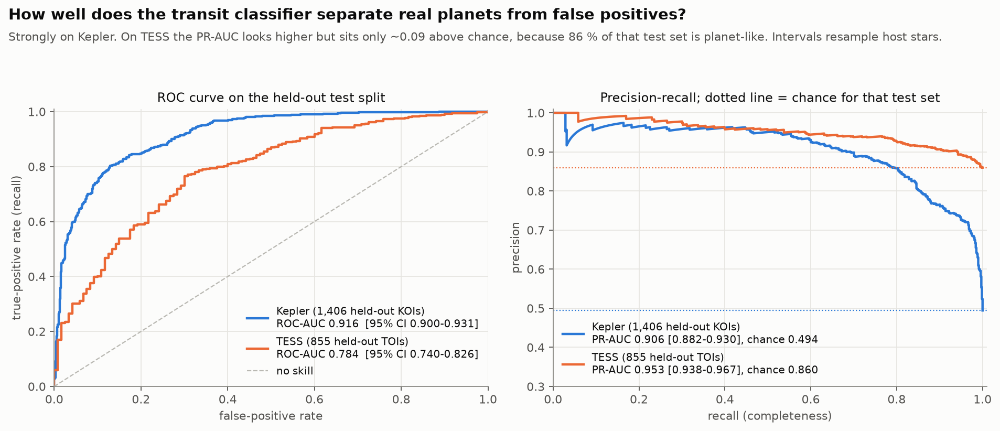
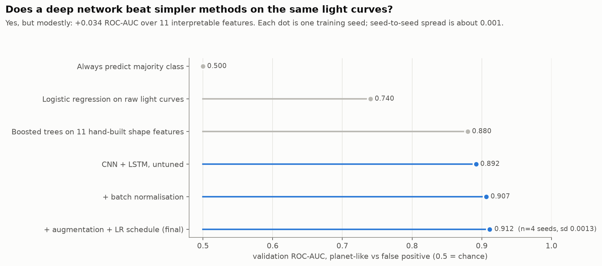
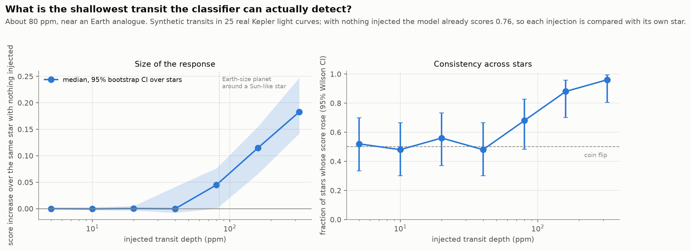
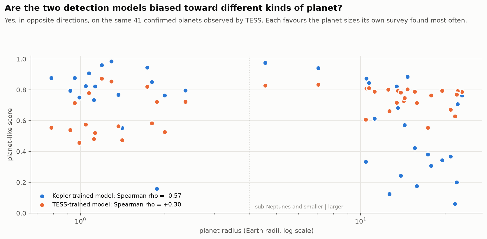

# Exoplanet detection → atmospheres → priority fusion

A three-stage pipeline: find transiting planets in Kepler and TESS photometry (Stage A),
characterise atmospheres from JWST transmission spectra (Stage B), then fuse both into a
ranked target table (Stage C).

**Start here:** the four result write-ups in [`eda/`](eda/) are the findings. Everything else
is the machinery that produced them.

| report | what it answers |
|---|---|
| [`eda/STAGE_A_LEVEL2_RESULTS.md`](eda/STAGE_A_LEVEL2_RESULTS.md) | the transit classifier: baselines, tuning, ablation, failure analysis |
| [`eda/TESS_AND_CROSS_MISSION_RESULTS.md`](eda/TESS_AND_CROSS_MISSION_RESULTS.md) | the TESS model, and transfer between missions |
| [`eda/STAGE_B_RESULTS.md`](eda/STAGE_B_RESULTS.md) + [`eda/STAGE_B_LEVEL2_RESULTS.md`](eda/STAGE_B_LEVEL2_RESULTS.md) | molecule classification, then physics-informed analysis |
| [`eda/STAGE_C_RESULTS.md`](eda/STAGE_C_RESULTS.md) | the 54-planet priority table and what is actually modelled in it |

[`run_log.txt`](run_log.txt) is the running record: every build, every result, every bug found
and what it changed. It is the honest history, including the things that went wrong.

**Reproducing it:** the results above need no download at all — they are committed here. To
re-run the modelling, fetch the view bundle from [release `v1.0-views`](https://github.com/WoolyBro/Exoplanet_Detection/releases/tag/v1.0-views) (~150 MB) and
see [Running this without a 30-hour download](#running-this-without-a-30-hour-download).

---

## Headline numbers

| | Kepler | TESS |
|---|---|---|
| test ROC-AUC (planet-like) | **0.9158** | 0.7843 |
| lift over the base rate | **+0.412** | +0.093 |
| precision at 90 % recall | 0.765 | 0.907 |
| views built | 9,394 | 5,791 |

The lift column matters more than the raw score: TESS's test set is 86 % planet-like, so a
PR-AUC of 0.95 there is barely above guessing, while Kepler's is a genuine result. This is
explained wherever those numbers appear.

---

## Results in figures

All twelve statistical figures, each titled by the question it answers and carrying 95 %
intervals, are in **[`figures/`](figures/)** and regenerate with `python figures/make_figures.py`.
Four that carry the main argument:

**How well does the transit classifier separate real planets from false positives?**


**Does a deep network beat simpler methods on the same light curves?**


**What is the shallowest transit the classifier can actually detect?**


**Are the two detection models biased toward different kinds of planet?**


**[See all twelve figures, with sources and interpretation &rarr;](figures/README.md)**

---

## Layout

Folders are named for the stage they serve. The mentor-supplied data pack is kept entirely
separate and is never written to.

```
exoplanet_research_data/     ← MENTOR'S PACK. Read-only, never modified by any script here.
                               Not in this repository (not ours to redistribute).

data_manifest.py             ← the gate: every script loads its data through this, so every
preprocessing_pipeline.py      input is declared in one place rather than opened ad hoc
split_catalogs.py            ← star-grouped train/val/test splits (read, never recomputed)
research_log.py              ← shared logging used by the pipeline scripts

catalog_preparation/         ← Stage 1: stellar host de-duplication
stage_a_transit_model/       ← Stage A: the CNN+LSTM transit classifier and every analysis of it
stage_b_atmospheres/         ← Stage B: JWST spectra → molecule labels (Level 1 + Level 2)
stage_b_rocky_benchmark/     ← Stage B: rocky-planet detection limits from the Zenodo compilation
stage_c_priority_fusion/     ← Stage C: the 54-planet priority table
stage_d_habitability/        ← PyATMOS / INARA habitability line
tools/                       ← operational scripts (status, cache pruning, resumable builds)

figures/                     ← the statistical figures + the script that makes them
eda/                         ← the written reports (.md) and diagnostic plots
outputs/                     ← result tables per stage
splits/                      ← the split definitions - results are not reproducible without these
detection_views/             ← 15,317 built views (.npz). Regenerable; not in the repository.
```

### Stage A — `stage_a_transit_model/`

| file | role |
|---|---|
| `cnn_lstm.py` | the model, training loop, metrics. `--mission Kepler\|TESS`, `--arch` for the ablation |
| `baselines.py` | majority / logistic / 11 interpretable shape features — **run before believing the CNN** |
| `sweep.py` | the 23-run hyperparameter and architecture sweep, resumable |
| `failure_analysis.py` | which false positives fool it, against the Kepler FP flags |
| `error_buckets.py` | false negatives split into undetectable / noise-dominated / genuine |
| `embeddings.py` | t-SNE **and** a measured separability check (the picture is not the evidence) |
| `cross_mission.py` | every model on every mission's test set |
| `final_eval.py` | the single held-out test evaluation |
| `make_figures.py` | the summary figure |

---

## Running this without a 30-hour download

The training inputs are 15,185 view files (~150 MB zipped) distilled from about **120 GB** of
photometry. That 120 GB was streamed and discarded star by star as the views were written, so
it was never stored — but rebuilding the views from scratch means downloading it again, which
takes roughly 30 hours. Nobody should have to do that to review the work. Three ways in,
cheapest first:

### 1. Read it — no download at all
Everything needed to check the analysis is already in this repository: the reports in
[`eda/`](eda/) contain every number, the figures, the result tables in `outputs/`, and
[`run_log.txt`](run_log.txt). `git clone` is 35 MB.

### 2. Run it on the committed sample — instant
[`detection_views_sample/`](detection_views_sample/) holds 252 real views (2.4 MB), 14 per
class per split, committed to this repository. Enough to run everything end to end:

```bash
pip install -r requirements.txt

python stage_a_transit_model/baselines.py \
    --train-views detection_views_sample/kepler_train \
    --val-views   detection_views_sample/kepler_val

python stage_a_transit_model/cnn_lstm.py --epochs 3 \
    --train-views detection_views_sample/kepler_train \
    --val-views   detection_views_sample/kepler_val
```

**These runs are smoke tests, not results.** 42 rows per split cannot reproduce a 0.9158
ROC-AUC, and the printed numbers should be read as "the pipeline works", nothing more. Rebuild
the sample with `python tools/make_sample_views.py`.

### 3. Reproduce the real numbers — one ~150 MB download
The full view set is published as release assets, [`v1.0-views`](https://github.com/WoolyBro/Exoplanet_Detection/releases/tag/v1.0-views), because 15,185
binary files do not belong in git history. Unpack it at the repository root:

```bash
gh release download v1.0-views --repo WoolyBro/Exoplanet_Detection   # or use the release page
for z in views_*.zip; do unzip -o -q "$z"; done                      # creates detection_views/
```

The bundle is split by split, so nothing has to be fetched that will not be used — Kepler alone is
`views_kepler_train.zip` (66 MB), `views_kepler_val.zip` and `views_kepler_test.zip` (14 MB each);
the TESS three are 42, 9 and 9 MB. `VIEWS_MANIFEST.json` on the release lists the view count in
each. (It is split because a single 155 MB asset would not upload reliably.)

**Quickest check — no training at all.** Both final checkpoints are committed, so the reported
test numbers can be regenerated directly from the selected artefact:

```bash
python stage_a_transit_model/final_eval.py --run stage_a_transit_model/runs/bn_aug_sched
```

To re-run the modelling itself, every command below reproduces the reported figures:

```bash
python stage_a_transit_model/baselines.py
python stage_a_transit_model/cnn_lstm.py --batchnorm --augment --scheduler
python stage_a_transit_model/sweep.py            # 23 runs
python stage_a_transit_model/cross_mission.py
python stage_b_atmospheres/stage_b_pipeline.py        # also needs the research pack (spectra)
python stage_b_atmospheres/stage_b_level2.py
python stage_c_priority_fusion/build_priority_table.py  # also needs the research pack (template)
```

The first four commands need only this repository plus the view bundle. The last three also read
the mentor's `exoplanet_research_data/` pack, which is not redistributed here (see
[Data handling](#data-handling)); without it those three exit with a missing-file error. Stage D
(`stage_d_habitability/`) does not run for anyone yet — its manifest entries still point at
absolute `D:/Files/...` paths.

### 4. Rebuild the views from the archives — the 30 hours
Only needed to verify the view construction itself, not the modelling:

```bash
python preprocessing_pipeline.py build-split train --discard-raw --s3
python preprocessing_pipeline.py build-split train --mission TESS --discard-raw --s3
```

`--discard-raw` deletes each star's raw photometry once its views are written, so peak disk
stays near 1 GB instead of 120 GB. Builds checkpoint per star and resume if interrupted;
`python tools/status.py` reports progress and time remaining.

---

## Things a reader should know before trusting anything here

These are in the reports too, but they are the load-bearing caveats:

1. **Both test sets are spent.** Kepler test was evaluated once for the final model; TESS test
   in the cross-mission run. Further tuning has to go back to validation.
2. **Neither detection model is unbiased, and their biases are opposite.** The Kepler model's
   score falls with planet radius (Spearman −0.570), the TESS model's rises (+0.302). Kepler's
   training split makes deep transits 93 % likely to be false positives; TESS's makes them
   11.5 %. This is measured, not assumed, and it is why the priority table carries both columns.
3. **The TESS build has a class-dependent yield** — 55.9 % of false positives survived the
   ephemeris-reliability check against 88.7 % of confirmed planets. That is selection bias, not
   just imbalance, and class weights do not fix it.
4. **Stage C is mostly empty on purpose.** The template shipped `transit_ML_probability = 0.99`
   for all 54 planets, which encodes "confirmed", not a prediction. Cells with no model behind
   them are left blank with a reason in `notes` rather than carried forward.
5. **`stage_d_habitability/` will not run as-is.** Those scripts read PyATMOS/INARA data from a
   `D:` drive on a previous machine; the paths are recorded in `data_manifest.py` and the data
   is not in this repository.

---

## Data handling

[`DATA_BOUNDARY.md`](DATA_BOUNDARY.md) has the full rules. In short: the mentor's pack is
treated as read-only, every input is declared in `data_manifest.py` rather than opened ad hoc,
and splits are read from `splits/` and never recomputed. Splits are grouped by star, so no
light curve from one target can appear in two folds.
