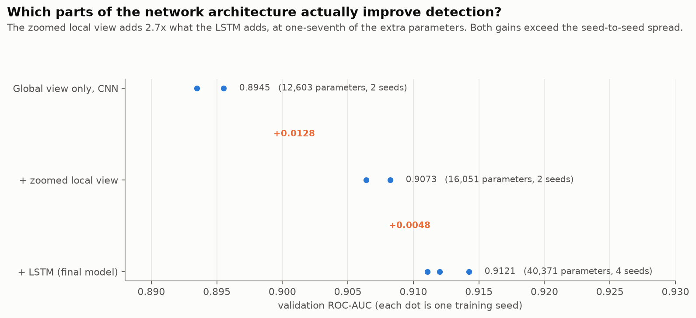
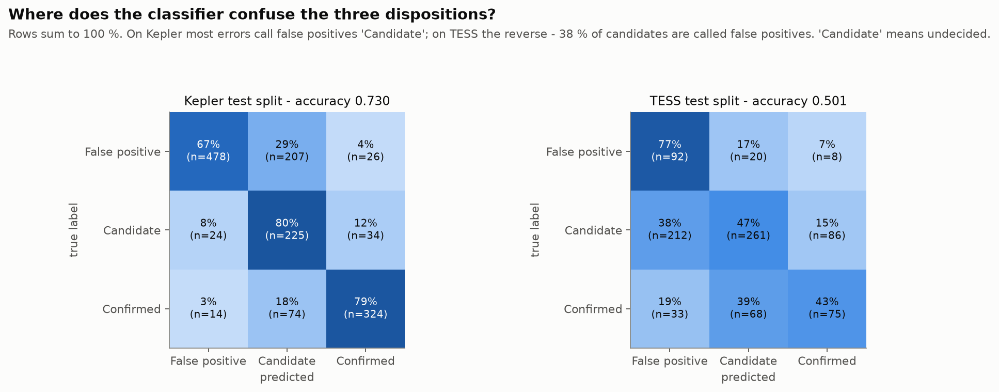
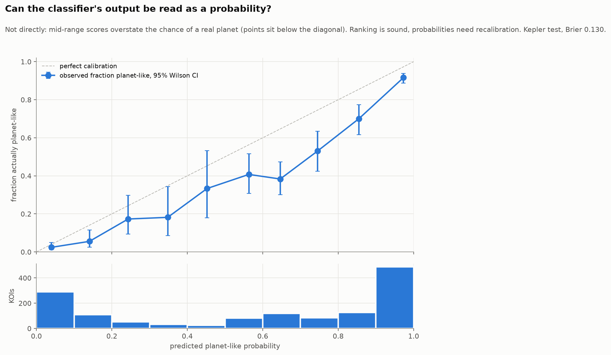
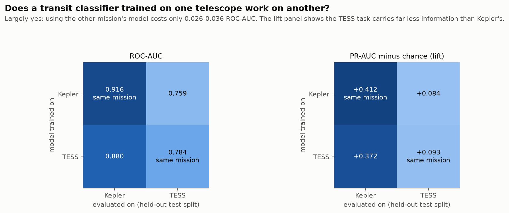
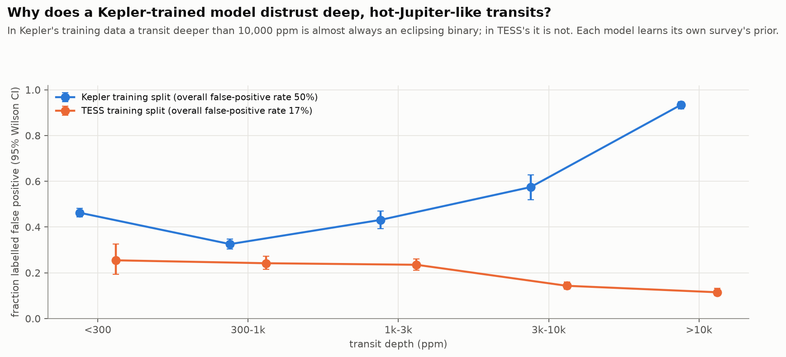
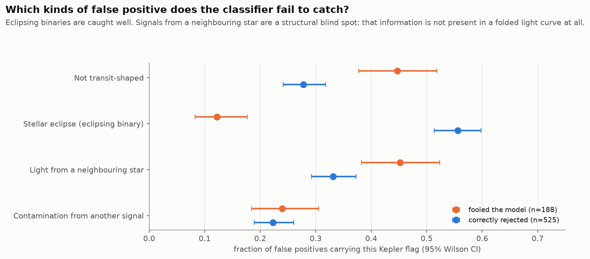
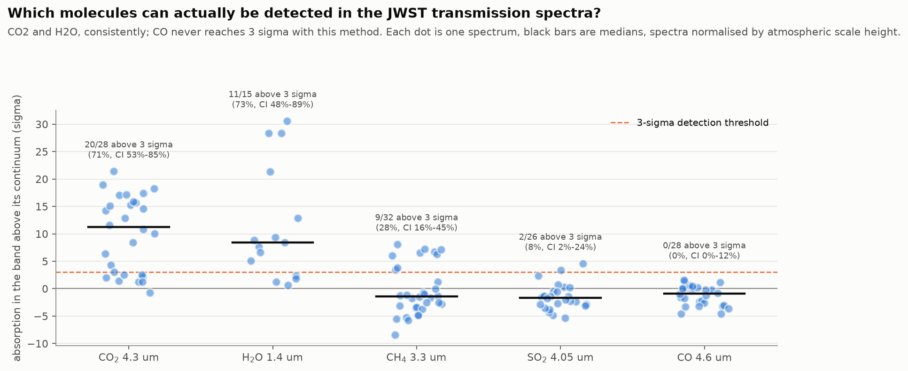
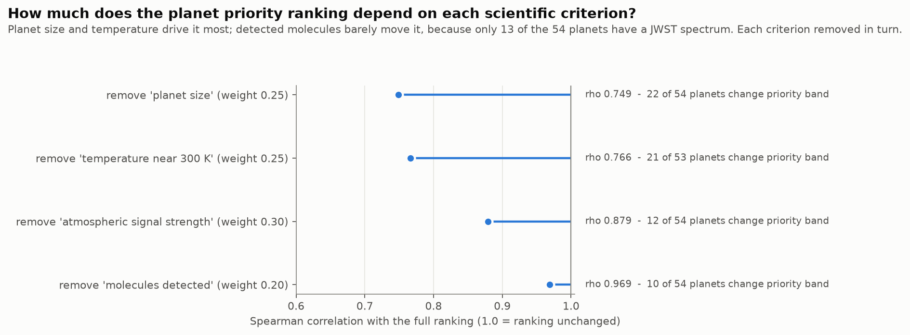

# Statistical figures

Every figure answers one question about the study. Each is regenerated from results committed to
this repository — no retraining, no downloads — by a single script:

```bash
python figures/make_figures.py
```

**Uncertainty is shown throughout.** ROC-AUC and PR-AUC carry 95 % bootstrap intervals that
resample *host stars* rather than rows, because several candidate signals share one star and are
not independent. Proportions carry 95 % Wilson score intervals. Model comparisons show every
training seed, so run-to-run noise is visible next to each difference.

| # | Question | Answer in one line |
|---|---|---|
| 1 | [How well does the classifier separate planets from false positives?](#1-how-well-does-the-transit-classifier-separate-real-planets-from-false-positives) | Kepler ROC-AUC 0.916 [0.900–0.931]; TESS 0.784 [0.740–0.826] |
| 2 | [Does a deep network beat simpler methods?](#2-does-a-deep-network-beat-simpler-methods-on-the-same-light-curves) | Yes, by 0.034 ROC-AUC over 11 hand-built features |
| 3 | [Which architecture parts improve detection?](#3-which-parts-of-the-network-architecture-actually-improve-detection) | The zoomed local view, far more than the LSTM |
| 4 | [Where does it confuse the three dispositions?](#4-where-does-the-classifier-confuse-the-three-dispositions) | Mostly around "Candidate", the undecided class |
| 5 | [Can its output be read as a probability?](#5-can-the-classifiers-output-be-read-as-a-probability) | Not directly — mid-range scores are over-confident |
| 6 | [Does a model from one telescope work on another?](#6-does-a-transit-classifier-trained-on-one-telescope-work-on-another) | Largely; transfer costs 0.026–0.036 ROC-AUC |
| 7 | [Why does a Kepler model distrust deep transits?](#7-why-does-a-kepler-trained-model-distrust-deep-hot-jupiter-like-transits) | In Kepler's data, deep transits are 93 % false positives |
| 8 | [Are the two models biased toward different planets?](#8-are-the-two-detection-models-biased-toward-different-kinds-of-planet) | Yes, in opposite directions by planet size |
| 9 | [Which false positives does it fail to catch?](#9-which-kinds-of-false-positive-does-the-classifier-fail-to-catch) | Signals from neighbouring stars; eclipsing binaries are caught |
| 10 | [What is the shallowest detectable transit?](#10-what-is-the-shallowest-transit-the-classifier-can-actually-detect) | About 80 ppm, near an Earth analogue |
| 11 | [Which molecules are detectable in JWST spectra?](#11-which-molecules-can-actually-be-detected-in-the-jwst-transmission-spectra) | CO₂ and H₂O; never CO with this method |
| 12 | [What drives the planet priority ranking?](#12-how-much-does-the-planet-priority-ranking-depend-on-each-scientific-criterion) | Planet size and temperature |

---

## Detecting transiting planets

### 1. How well does the transit classifier separate real planets from false positives?

Measured once on held-out test data never used for tuning. The TESS precision-recall curve sits
high only because 86 % of that test set is planet-like — the dotted lines mark chance for each set,
and the honest comparison is the height above them.
*Source:* `stage_a_transit_model/runs/*/test_predictions.csv`

### 2. Does a deep network beat simpler methods on the same light curves?

Every method sees the same phase-folded light curves. The baselines were built first, so the
network had a concrete bar to clear.
*Source:* `stage_a_transit_model/runs/baselines/`, `runs/sweep_comparison.csv`

### 3. Which parts of the network architecture actually improve detection?

Components added one at a time with every other setting held fixed.
*Source:* `stage_a_transit_model/runs/sweep_comparison.csv`

### 4. Where does the classifier confuse the three dispositions?

*Source:* `stage_a_transit_model/runs/*/final_eval.json`

### 5. Can the classifier's output be read as a probability?

The ranking is good (figure 1) but the score is not a calibrated probability. Anyone thresholding
it as "70 % chance of a planet" would be wrong; it needs recalibration (e.g. isotonic) first.
*Source:* `stage_a_transit_model/runs/bn_aug_sched/test_predictions.csv`

### 6. Does a transit classifier trained on one telescope work on another?

*Source:* `stage_a_transit_model/runs/cross_mission/cross_mission.csv`

## Why the models behave as they do

### 7. Why does a Kepler-trained model distrust deep, hot-Jupiter-like transits?

*Source:* `splits/koi_cumulative_split.csv`, `splits/toi_tess_candidates_split.csv`

### 8. Are the two detection models biased toward different kinds of planet?

Both models scored the same confirmed planets from TESS light curves, so any difference is the
model, not the data.
*Source:* `outputs/stage_c/priority_target_scores_*.csv`

### 9. Which kinds of false positive does the classifier fail to catch?

*Source:* `stage_a_transit_model/runs/bn_aug_sched/failure_analysis/`

### 10. What is the shallowest transit the classifier can actually detect?

Synthetic transits were injected into real light curves before detrending. With nothing injected
the model already returns a high score, so it is a **candidate vetter, not a blind transit search**;
each injection is therefore measured against the same star with nothing added.
*Source:* `outputs/injection_recovery/injections.csv`

## Atmospheres and target selection

### 11. Which molecules can actually be detected in the JWST transmission spectra?

*Source:* `outputs/stage_b_level2/band_indices.csv`

### 12. How much does the planet priority ranking depend on each scientific criterion?

*Source:* `outputs/stage_c/ablation.csv`
